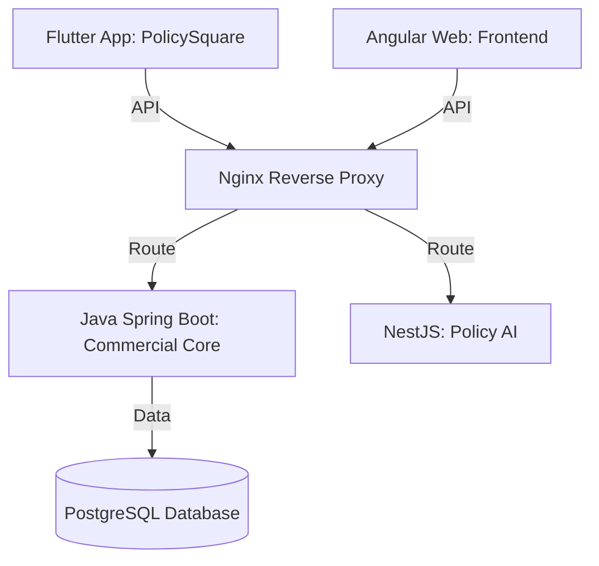

# PolicySquare & Inspection Report Platform

A comprehensive, multi-tier platform designed for commercial insurance management, automated inspection reporting, risk assessment, and claims processing. The platform comprises a cross-platform client app, web portal, enterprise core backend, AI microservices, and containerized deployment infrastructure.

---

## 🏗️ Architecture & Component Stack

The repository is structured as a multi-service monorepo:



### 1. 📱 Cross-Platform Client (`/policysquare`)
* **Technology**: Flutter (Dart)
* **Description**: A premium mobile/web client for field inspectors, underwriters, and agents.
* **Key Features**:
  * **Interactive Inspection Reports**: Fill and view detailed on-site inspection data.
  * **Risk Assessment & History**: Manage and review risk levels and property criteria.
  * **Request for Quote (RFQ)**: Direct digital workflows for underwriters.
  * **Underwriting Tips & Chat**: Real-time advice, insights, and messaging capabilities.

### 2. 🖥️ Web Portal (`/frontend`)
* **Technology**: Angular (TypeScript)
* **Description**: Administration portal for document extraction and detailed policy analysis.
* **Key Features**:
  * **PDF Extraction Engine**: Tooling for parsing and analyzing documents (e.g., `extract_pdf.js`).

### 3. ☕ Core Enterprise Backend (`/backend`)
* **Technology**: Java (Spring Boot) / Maven
* **Description**: Secure REST API handling business logic, user auth, and transactional database actions.
* **Key Features**:
  * **Domain Entities**: `ClaimStory`, `RiskAssessment`, `Rfq`, `HealthPremiumMatrix`, `UnderwritingTip`.
  * **Database**: PostgreSQL integrations.
  * **Security**: Token-based authentication and role-based permissions.

### 4. 🧠 AI Services (`/ai-services/policy-ai`)
* **Technology**: NestJS (Node.js) / TypeScript
* **Description**: Dedicated microservice for AI-driven policy checks and document processing.

### 5. 🐳 Infrastructure (`/nginx`, `docker-compose.yml`)
* **Technology**: Docker Compose & Nginx
* **Description**: Easy orchestration to spin up database, backend, and reverse-proxy services.

---

## 🚀 Getting Started

### Prerequisites
* [Docker & Docker Compose](https://www.docker.com/products/docker-desktop/)
* [Flutter SDK](https://docs.flutter.dev/get-started/install) (for client development)
* [Java JDK 17+](https://adoptium.net/) (for local backend development)
* [Node.js v18+](https://nodejs.org/) (for Angular & NestJS)

### Containerized Spin-up (Recommended)
You can run the core backend, database, and routing server using Docker Compose:

1. Copy env variables / verify values in `docker-compose.yml`.
2. Run:
   ```bash
   docker compose up --build
   ```
3. Nginx will route HTTP traffic on ports `80` (HTTP) and `443` (HTTPS) to the relevant backend and frontend services.

### Running Services Locally

#### Backend (Spring Boot):
```bash
cd backend
mvn clean install
mvn spring-boot:run
```

#### Policy AI (NestJS):
```bash
cd ai-services/policy-ai
npm install
npm run start:dev
```

#### Web Frontend (Angular):
```bash
cd frontend
npm install
npm run start
```

#### Mobile/Web App (Flutter):
```bash
cd policysquare
flutter pub get
flutter run
```

---

## 📄 License
This project is proprietary and confidential. All rights reserved.
